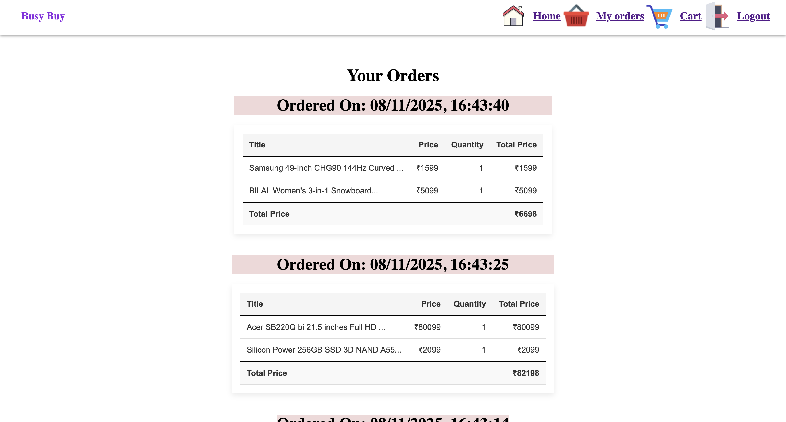

# 🛒 BuyBusy-II — E-Commerce Web App (React + Redux Toolkit + Vite + Firebase)

[](https://react.dev/)
[](https://vitejs.dev/)
[](https://redux-toolkit.js.org/)
[](https://firebase.google.com/)
[](https://opensource.org/licenses/MIT)

> A **modern, scalable e-commerce web application** built using **ReactJS**, **Vite**, **Redux Toolkit**, and **Firebase Firestore**.  
> This project is a fully functional shopping platform where users can browse products, add them to the cart, manage orders, and securely log in or sign up — all powered by **Firebase Authentication** and **Firestore Database**.

---

## 🏪 Project Overview

**BuyBusy-II** is a next-generation version of my previous BuyBusy app.  
While the earlier version used **React Context API** for state management, this version leverages **Redux Toolkit**, providing a more efficient, predictable, and scalable state management solution.

The app is a full-fledged **e-commerce platform** that supports:

- 🧾 **User authentication** (Signup/Login via Firebase)
- 🛍️ **Product browsing and filtering**
- 🛒 **Add-to-cart and order management**
- 💳 **Persistent data storage** in Firebase Firestore
- ⚙️ **Global State Management** using Redux Toolkit

---

## ✨ Key Features

### 👤 User Authentication

- Secure **signup** and **login** using **Firebase Authentication**.
- Supports **Google Firebase Auth System** for secure credential management.

### 🛍️ Product Management

- Fetches products from **Firestore Database** in real-time.
- Products can be **filtered** by price and category.
- Displays all products in a responsive grid layout.

### 🛒 Shopping Cart

- Add, remove, and update product quantities.
- Cart data stored and synchronized in **Firebase Firestore**.
- Managed centrally using **Redux Toolkit** async thunks.

### 📦 Order Management

- Users can **place orders** and view their order history.
- Orders stored persistently in Firestore.
- Clean and minimal **Orders Page** with real-time updates.

### 🚀 Modern State Management with Redux Toolkit

- Used **createSlice()** for reducers and actions.
- Used **createAsyncThunk()** for Firestore API calls.
- Application-level state handled globally with Redux Store.

### ⚠️ Error Handling

- Dedicated **Error Page** component for handling route or API failures.
- Displays a user-friendly message if a route doesn’t exist.

### ⚡ Optimized with Vite

- Project initialized using **Vite**, providing:
  - Lightning-fast development server
  - Lightweight build setup
  - Better developer experience

---

## 🧱 Folder Structure

```
MINI-PROJECT-BUYBUSY-II/
│
├── public/
│   └── vite.svg
│
├── screenshots/                   # Project preview images
│   ├── 1.png
│   ├── 2.png
│   ├── 3.png
│   ├── 5.png
│   └── 6.png
│
├── src/
│   ├── assets/
│   ├── components/
│   │   ├── Navbar/
│   │   ├── FilterSidebar/
│   │   ├── OrderTable/
│   │   └── Product/
│   │       ├── ProductContainer/
│   │       └── ProductGrid/
│   │
│   ├── configDB/
│   │   └── firebase.js            # Firebase config & initialization
│   │
│   ├── pages/
│   │   ├── HomePage/
│   │   ├── CartPage/
│   │   ├── OrdersPage/
│   │   ├── RegisterPage/
│   │   ├── LoginPage/
│   │   └── NotFoundPage/          # Error Page
│   │
│   ├── redux/
│   │   ├── actions/
│   │   ├── reducers/
│   │   ├── middlewares/
│   │   └── store/
│   │
│   ├── App.jsx
│   ├── App.css
│   ├── main.jsx
│   ├── index.css
│   └── data.js
│
├── package.json
├── vite.config.js
└── README.md

```

---

## ⚙️ Tech Stack

| Category               | Technology Used     |
| ---------------------- | ------------------- |
| **Frontend Framework** | ReactJS (with Vite) |
| **State Management**   | Redux Toolkit       |
| **Backend**            | Firebase Firestore  |
| **Authentication**     | Firebase Auth       |
| **Routing**            | React Router DOM v7 |
| **Notifications**      | React Toastify      |
| **Styling**            | CSS Modules         |
| **Build Tool**         | Vite                |
| **Language**           | JavaScript (ES6+)   |

---

## 🧠 Core Redux Implementation

- 🔁 Example: Async Fetch with createAsyncThunk

```bash
export const getInitialProductStateAsync = createAsyncThunk(
  "product/getInitialState",
  async (_, { rejectWithValue }) => {
    try {
      const querySnapshot = await getDocs(collection(db, "products"));
      return querySnapshot.docs.map((doc) => ({ ...doc.data(), id: doc.id }));
    } catch (error) {
      return rejectWithValue(error.message);
    }
  }
);

```

## ⚙️ Example Slice

```bash
const productSlice = createSlice({
  name: "product",
  initialState,
  reducers: {},
  extraReducers: (builder) => {
    builder
      .addCase(getInitialProductStateAsync.pending, (state) => {
        state.loading = true;
      })
      .addCase(getInitialProductStateAsync.fulfilled, (state, action) => {
        state.loading = false;
        state.products = action.payload;
      })
      .addCase(getInitialProductStateAsync.rejected, (state, action) => {
        state.error = action.payload || "Failed to fetch products";
      });
  },
});

```

## 🧩 Store Configuration

```bash
export const store = configureStore({
  reducer: {
    productReducer,
    cartReducer,
  },
  middleware: (getDefaultMiddleware) =>
    getDefaultMiddleware().concat(loggerMiddleware),
});

```

---

## 🖼️ Project Screenshots

- 🏠 Home Page:
  

- 🛍️ Product Page:
  

- 🛒 Cart Page:
  

- 📦 Order Page:
  

- 🔐 Login & Register Pages:
  
  

---

## 🚀 Getting Started

### Clone the Repository

```bash
git clone https://github.com/kanishk-469/BuyBusy-II-E-Commerce-Web-App-React-Redux-Toolkit-Vite-Firebase.git
```

### Install Dependencies

```bash
npm install
```

### Run the App

```bash
npm run dev or npm start
```

- Then open http://localhost:5173 in your browser.

---

## 🎯 Highlights

- 🔄 Redux Toolkit Integration – Replaces Context API with structured state management.
- 🔥 Firebase Firestore – Real-time database for products and cart items.
- 🧭 React Router v7 – Seamless navigation between pages.
- 🧰 Error Handling Middleware – Custom logger middleware for Redux actions.
- 💡 Component-based architecture – Clean, modular, and maintainable structure.

---

## 🧭 Future Enhancements

- ✅ Add Wishlist and Favorites feature
- 🧾 Integrate Payment Gateway (Razorpay / Stripe)
- 🔐 Role-based access for Admin vs Customer
- 🌙 Dark/Light theme support
- 📊 Dashboard for product analytics

---

## 👨‍💻 Author

**Kanishka Singh**  
 Full-Stack Web Developer | React Enthusiast | UI Recreator | Backend API creator
🌐 [GitHub](https://github.com/kanishk-469)  
💼 [LinkedIn](https://www.linkedin.com/in/kanishka-singh-14291157/)

---

> 🛒 _“Shop smart. Shop fast. Shop BuyBusy — powered by React, Redux, and Firebase.”_
